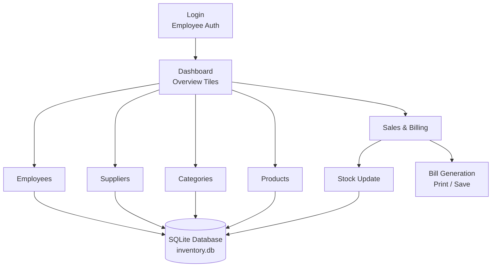

<div align="center">


**A complete desktop inventory and billing system — built for small retail stores that need a fast, reliable, no-fuss GUI**

[](https://www.python.org/)
[](https://docs.python.org/3/library/tkinter.html)
[](https://www.sqlite.org/)
[](https://pandas.pydata.org/)

<br/>

[](https://github.com/SamarthDharpure/Quantix/stargazers)
[](https://github.com/SamarthDharpure/Quantix/network)
[](https://github.com/SamarthDharpure/Quantix/issues)
[](https://github.com/SamarthDharpure/Quantix/commits)
[](#-license)

[Overview](#-overview) · [Features](#-features) · [Workflow](#-workflow) · [Tech Stack](#-tech-stack) · [Getting Started](#️-getting-started) · [Usage](#-usage) · [Screenshots](#-screenshots) · [Roadmap](#-roadmap)

</div>

<br/>

## 📖 Overview

**Quantix** is a desktop inventory management system built with **Python (Tkinter)** and **SQLite**, designed to replace manual paperwork for small retail businesses with a single, friendly GUI. It handles the full operational loop — employees, suppliers, categories, products, and point-of-sale billing — in one local application with no server setup required.

<br/>

<div align="center">

|  🧩 CRUD Modules  |  ⚡ Billing Speed  |  🔐 Access Control  |  💾 Database  |
|:---:|:---:|:---:|:---:|
|  **5**  |  **60% faster**  |  **Role-based**  |  **SQLite**  |

</div>

<br/>

## ✨ Features

<table>
<tr>
<td width="50%">

### ✅ User Authentication
Secure employee login gating access to the system.

### 🧾 Full CRUD
Complete management of Employees, Suppliers, Categories, and Products.

### 🛒 Sales & Billing
End-to-end billing module with printable customer bills.

### 🔎 Search & Filters
Fast lookups across every record type — search-by or show-all.

</td>
<td width="50%">

### 🧮 Built-in Calculator
Quick arithmetic on hand during billing, no context-switching.

### 📦 Stock Management
Live in-stock tracking with automatic quantity updates.

### 🖨️ Bill Generation & Print
One-click export and printing of the customer bill area.

### 🗂️ Bill History Viewer
Browse and reopen previously saved bill files.

</td>
</tr>
</table>

<br/>

## 🔄 Workflow



**Flow:** an employee logs in and lands on the dashboard, which surfaces live totals across every module. Product, supplier, category, and employee records all read/write through a shared SQLite database, while the Sales module additionally updates stock levels and generates a printable, saved bill on checkout.

<br/>

## 🧑‍💻 Tech Stack

<div align="center">

| Layer | Technology |
|---|---|
| **GUI** | Python 3.10+ · [Tkinter](https://docs.python.org/3/library/tkinter.html) (tk, ttk) · [Pillow](https://pypi.org/project/pillow/) · tkcalendar *(optional)* |
| **Database** | [SQLite3](https://www.sqlite.org/) *(default — configurable to MySQL/MariaDB)* |
| **Tooling** | VS Code / PyCharm · Git & GitHub |

</div>

<br/>

## 📂 Project Structure

```
Quantix/
├── main.py                # App launcher
├── database.py            # DB connection & helpers (SQLite)
├── employees.py           # Employee CRUD + UI
├── suppliers.py           # Supplier CRUD + UI
├── categories.py          # Category CRUD + UI
├── products.py            # Product CRUD + UI
├── sales.py                # Billing & sales flow
├── utils.py                # Calculator, printing utilities
├── requirements.txt
├── images/                 # UI assets & screenshots
└── data/
    └── inventory.db        # created on first run
```

> File names above reflect the module breakdown — adjust commands if your actual filenames differ.

<br/>

## ⚙️ Getting Started

### Prerequisites
- Python 3.10+

### 1. Clone the repository

```bash
git clone https://github.com/SamarthDharpure/Quantix.git
cd Quantix
```

### 2. Create & activate a virtual environment

```bash
python -m venv venv

# Windows
venv\Scripts\activate

# macOS / Linux
source venv/bin/activate
```

### 3. Install dependencies

```bash
pip install -r requirements.txt
# if requirements.txt isn't present:
pip install pillow tkcalendar
```

### 4. Database

Uses **SQLite** by default — `inventory.db` is created automatically on first run. To use MySQL instead, update the connection config in `database.py` and install `mysql-connector-python`.

### 5. Run the app

```bash
python main.py
```

<br/>

## 🚀 Usage

1. **Login** with a valid employee ID and password
2. **Dashboard** shows live totals for employees, suppliers, categories, products, and sales
3. **Manage records** — Add / Update / Delete / Search across each module from the side menu
4. **Sales** — add customer details, select products, adjust quantities, apply discounts, and generate a printable bill
5. **Bill history** — reopen and review any previously saved bill

<br/>

## 📸 Screenshots

<div align="center">

| Login | Dashboard |
|:---:|:---:|
|  |  |

| Employee Management | Product Management |
|:---:|:---:|
|  |  |

| Supplier Management | Sales & Billing |
|:---:|:---:|
|  |  |

| POS / Shopping View |
|:---:|
|  |

</div>

<br/>

## 🗺️ Roadmap

- [ ] Multi-user mode with concurrent access
- [ ] REST API layer for external integrations
- [ ] Optional web frontend
- [ ] Sales analytics dashboard (charts & trend reports)
- [ ] PDF export for bills (in addition to print)

> Have an idea? [Open an issue](https://github.com/SamarthDharpure/Quantix/issues) — contributions and suggestions are welcome.

<br/>

## 🤝 Contributing

Contributions are welcome! Especially interested in multi-user mode, a REST API, or a web frontend.

1. Fork the repo
2. Create a feature branch (`git checkout -b feature/my-feature`)
3. Commit your changes and push
4. Open a Pull Request describing your changes

Please follow a consistent code style and include tests where applicable.

<br/>

## 📜 License

Distributed under the **MIT License**. See [`LICENSE`](LICENSE) for details.

<br/>

## 🧑‍💻 Author

<div align="center">

**Samarth Dharpure**

[](https://www.linkedin.com/in/samarth-dharpure-88a10b248/)
[](https://github.com/SamarthDharpure)

</div>

<br/>

<div align="center">

### ⭐ If Quantix was useful to you, consider giving it a star — it helps a lot!

</div>
